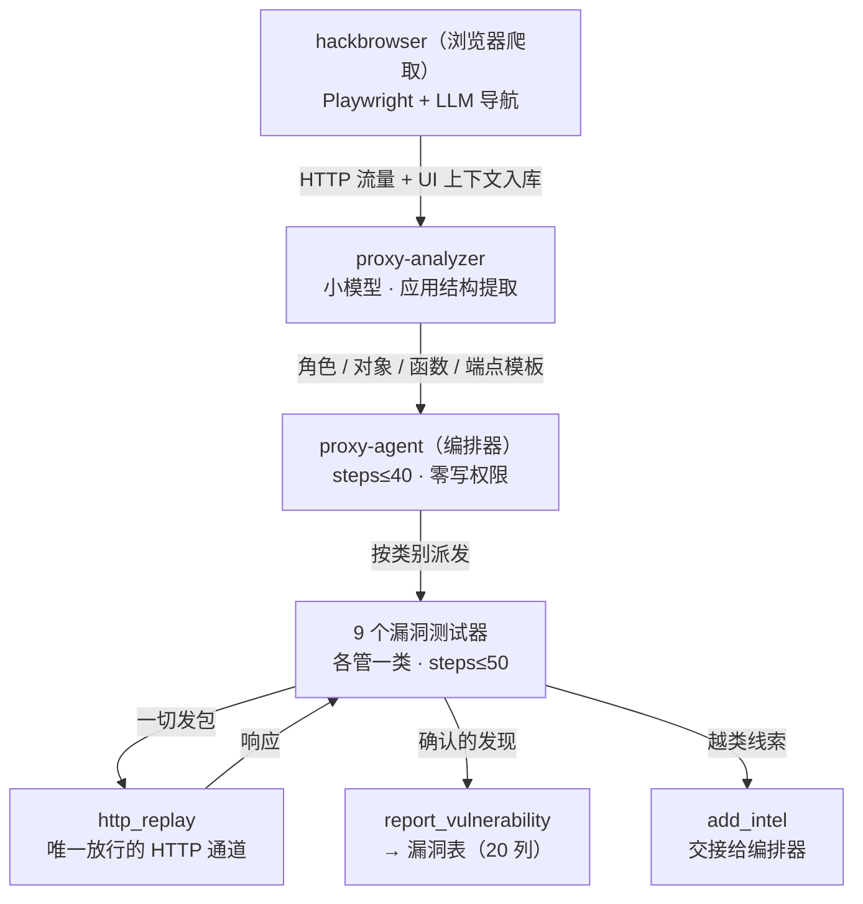

# 代理测试流水线

这是 CyberStrike 区别于 opencode 的核心机制：一条把"浏览器捕获的 HTTP 流量"加工成"分类漏洞报告"的流水线，由 11 个智能体分工完成，全部发包收敛到一个可审计的通道。

代码位置：角色定义在 `src/agent/agent.ts`（编排器/分析器/测试器），提示词在 `src/agent/prompt/orchestrator|analyzer|vuln/`，捕获数据模型在 `src/session/web/` 与 `src/session/session.sql.ts`（五张结构表），权限规则在 `agent.ts` 的合并逻辑，发包通道在 `src/tool/`（`http_replay`）。

## 流水线全景

## 第 1 环：hackbrowser 捕获

`packages/hackbrowser/` 是一个独立的 AI 驱动浏览器：Playwright 打开目标页面，LLM 读取页面的无障碍树（accessibility tree）决定下一步动作——点哪个按钮、填哪个表单、走哪条登录流程。全过程捕获 HTTP 请求。

它对每个页面额外生成 **UI 上下文快照**，内容包括：

- 哪些输入框 readonly / disabled / hidden；
- 字段的"显示值 vs 提交值"是否一致（不一致就是潜在的参数篡改点）；
- 请求体里存在、但 UI 上看不到的隐藏参数；
- 前端做了哪些客户端校验（服务端未必校验——这就是测试点）。

这些信息随请求一起入库，后续直接喂给测试器。工具参数（`src/tool/hackbrowser.ts`）：

| 参数 | 说明 |
| --- | --- |
| `target` | 必填；同时用来自动推导网络范围（`*.{eTLD+1}`） |
| `credentials` | 可选，凭据 ID 数组。传一个 = 手动登录一次后爬取；传多个 = 每个凭据各登录爬取一轮（角色差异测试）。**自动填密码登录被刻意不支持**——每个带凭据的爬取都会打开可见浏览器等真人登录，所以只应在有人在场时传这个参数 |
| `scope` / `exclude` | 域名白名单 / 要跳过的 UI 元素或路径 |
| `steps` | 最多爬多少页，默认 50，上限 200 |
| `headless` | 默认 true；传了凭据强制 false（人工登录需要可见窗口） |

## 第 2 环：proxy-analyzer 结构提取

隐藏子代理，步数上限 20，**刻意使用小模型**（`useSmallModel`）——这是机械的结构化任务，不需要最强模型。它把捕获流量整理成五张结构表：

| 表 | 提取内容 |
| --- | --- |
| `web_role` | 应用角色（普通用户/管理员…）与发现来源 |
| `web_object` / `web_object_value` | 数据对象（字段、敏感字段、ID 字段）；每个凭据各自看到的对象值 |
| `web_function` | 应用功能（动作类型 + 关联请求/角色/对象） |
| `endpoint_template` | 端点路径模板（参数归一化），带置信度与命中计数 |
| `web_credential` | 测试凭据与关联角色 |

## 第 3 环：proxy-agent 编排

编排器读结构提取结果，决定派发哪些测试器、按什么顺序。两条硬约束：

- **步数上限 40**（`STEP_CAPS`），防失控循环；
- **零写权限**：`"*": "deny"` 之后只白名单委派类与读类工具——编排器结构上不能自己写漏洞结论或发包，只能指挥。

## 第 4 环：九个测试器

每个测试器是一个隐藏子智能体，只负责一类漏洞，步数上限 50。它的提示词由三部分拼成：公共测试纪律（`prompt/vuln/common-prompt.txt`）+ 类别专属提示（如 `vuln/idor/prompt.txt`）+ 静态注入的 WSTG 用例全文。

以 IDOR 测试器为例，它的提示词把"什么情况该测"分成三档：

- **高优先**：请求里有数字 ID / UUID / 对象标识；或服务器信任请求里提交的归属 ID（登录步骤里提交 `user_id` 而服务器拿它定会话——这本身就是 IDOR）；
- **中优先**：只有一个凭据时也测（顺序 ID、负数、边界值）；
- **跳过**：请求里没有任何对象引用（纯登录/搜索，无独立归属 ID）。

执行流程是固定四步：`web_get_session_context` 查可用凭据与对象 → 识别当前请求里的对象引用 → 构造测试矩阵（多凭据时"用 A 的凭据读 B 发现的 ID"）→ 逐项发包验证。

**测试器互相隔离**：只测自己类别的问题；发现别的类别的问题时不许越类测、也不许越类上报——写一行 `add_intel(vulnerability_hint)` 交接给编排器路由给对的测试器，然后继续干自己的活。公共提示词的原话："Be thorough on YOUR class; be brief on everything else."

## 权限纪律：四条规则

流水线的约束不靠提示词自觉，全部落在权限规则上（继承 opencode 的 Ruleset 机制，但用法是新设计）：

| 规则 | 实现 | 目的 |
| --- | --- | --- |
| 测试器禁止直连发包 | deny 一切绕过路径：`curl` / `wget` / Python 的 requests、urllib、httpx、aiohttp / bun、node、deno 的 eval / `nc`、`ncat`、`socat`、`telnet` / `base64 \| python` 管道 / `webfetch` | 所有请求必须走 `http_replay`——可记录、可审计、可重放。源码注释："the ONLY way to send HTTP requests. Permission-enforced" |
| 编排器零权限 | `"*": "deny"` + 白名单委派/读类 | 编排器结构上不能写结论、不能发包 |
| 破坏性命令硬禁止 | 注入类测试器的规则合并里追加 deny：`DROP TABLE` / `DROP DATABASE` / `INTO OUTFILE` / `xp_cmdshell` / `--os-shell` / sqlmap 危险旗标等，**合并位置在用户配置之后**——用户自己也解除不了 | 测试不得破坏目标数据 |
| 测试器类别边界 | `vuln-scope.ts`：`report_vulnerability` 校验调用者只能报自己类别的漏洞；`update_vrt_check` 越类直接拒绝 | 防分类混乱与重复上报 |

一个实现细节：opencode 的规则求值是"**最后一条匹配的规则生效**"，所以这套规则里 `*: allow` 之类的宽松项必须写在 deny 之前——源码注释专门提醒了这个顺序敏感性。

## 上报：不是"报了就算"

`report_vulnerability` 的参数里有三个特别设计的字段（`src/tool/vulnerability.ts`）：

| 字段 | 规则 |
| --- | --- |
| `execution_evidence` | 执行类漏洞（XSS/SSTI/命令注入/反序列化 RCE）要报 critical/high **必须**附"触发证据"——实际返回的成功标志字符串、`alert()` 实际弹出的文本、headless 检查器结果。提示词明确写了"叙述性的'能利用'不算证据" |
| candidate 降级 | 没有触发证据时发现**仍然记录**（不静默丢弃），但严重度封顶 medium，且在 `candidate` 列标记"从哪个严重度降下来的"——降级是代码根据证据有无决定的，**模型的口头主张无效** |
| 原地升级 | 后续拿到证据时，同一条发现可以升级：清除 candidate 标记、恢复原严重度——记录不重开、历史不断 |

这套设计加上复核工具 `triage_vulnerability`（分诊合并重复），构成上报侧的完整防线：模型的口头严重度主张会被证据门槛覆盖。

## 与 AtkBrain 的流水线对照

| 话题 | AtkBrain | CyberStrike |
| --- | --- | --- |
| 流水线形态 | 御主出方案 → 从者派工人（角色按方案动态定） | 固定流水线：捕获 → 结构提取 → 编排 → 9 个分类测试器 |
| 测试目标建模 | 攻击图（节点/边/Intent） | 五张结构表（角色 × 对象 × 函数 × 端点模板） |
| 测试器边界 | 图上前沿驱动，无类别限制 | 每个测试器绑定漏洞类别，越类走情报交接 |
| 发包管控 | 权限守卫 + 代理链（防出界） | 权限封锁直连，强制走唯一可审计通道 |
| 上报可信化 | 入库硬校验 + 二次验证 + 评级 | 触发证据门槛 + candidate 降级 + 原地升级 |

下一页：[Bolt 与报告](/agents/cyberstrike/bolt-and-report)。