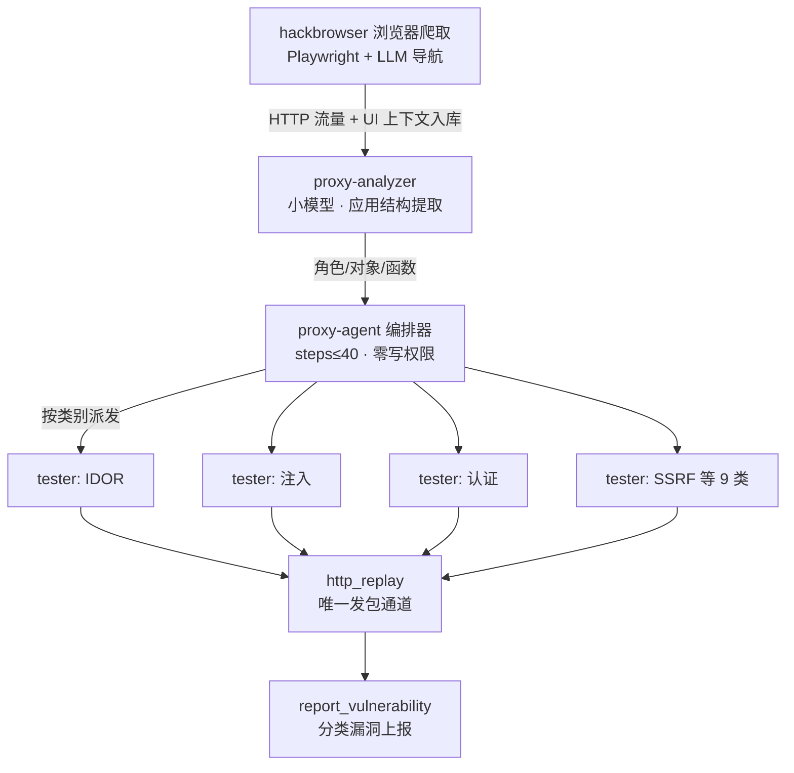

# 代理测试流水线

这一页讲 CyberStrike 区别于 opencode 的核心机制：一条把"浏览器捕获的流量"变成"分类漏洞报告"的流水线，以及支撑它的权限纪律。

代码位置：流水线编排在 `src/agent/agent.ts`（编排器与测试器定义），捕获数据模型在 `src/session/web/`（端点、角色、凭据、对象、函数五张表）与 `src/session/ingest-queue.ts`，权限在 `agent.ts` 的规则合并逻辑，发包通道在 `src/tool/` 的 `http_replay`。

## 流水线全景

## 各环节说明

**1. hackbrowser：捕获**（`packages/hackbrowser/`）。一个独立的 AI 驱动浏览器：Playwright 打开目标页面，LLM 读页面的无障碍树决定下一步动作（点击、填表、登录），全过程捕获 HTTP 请求，并对每个页面生成 UI 上下文快照——哪些输入框只读/禁用/隐藏、显示值与提交值是否一致、有没有不出现在界面上的隐藏参数、前端做了哪些校验。这些信息是后续测试器的原料（隐藏参数往往是测试点）。支持登录态保存与 `--scope` 域名限制。在主程序中以子进程运行（`src/hackbrowser-subprocess/`），由 `hackbrowser` 工具调用。

**2. proxy-analyzer：结构提取**（隐藏智能体，步数上限 20）。从捕获的流量里提取应用结构：这个站点有哪些角色（普通用户/管理员）、哪些数据对象、哪些函数接口。**刻意使用小模型**（`useSmallModel`）——这是机械的结构化任务，不需要最强模型，省成本。

**3. proxy-agent：编排**（步数上限 40）。读结构提取结果，决定派发哪些测试器、按什么顺序。它的权限被设为零：`"*": "deny"` 之后只白名单委派类与读类工具——**编排器结构上不能自己写结论或发包**，只能指挥。

**4. 九个测试器**：每个测试器是一个隐藏子智能体，只负责一类漏洞（IDOR、授权、批量赋值、注入、认证、业务逻辑、SSRF、文件攻击、LLM），启动时静态注入对应的 WSTG 用例全文（例如 IDOR 测试器注入 `wstg-authz-04`、`wstg-apit-02` 两份用例）。**一个测试器只测自己的类别**：发现别的类别的问题时，必须走 `add_intel` 把线索交接出去，不能越类上报（工具层强制，见下文）。

**5. http_replay：唯一发包通道。** 测试器执行的所有 HTTP 请求必须通过 `http_replay` / `http_replay_raw` 工具——每一次发包都被记录、可审计、可重放。

## 权限纪律：把攻击面约束写进权限规则

这一层继承 opencode 的权限 Ruleset 机制，但把它用作**流水线纪律**，有四条值得注意的规则（都在 `agent.ts`）：

| 规则 | 实现 | 目的 |
| --- | --- | --- |
| 测试器禁止直连发包 | deny `curl` / `wget` / python 的 requests、urllib、httpx / `nc`、`socat` / bun、node、deno 的 eval 等一切绕过路径 | 所有请求必须走 `http_replay`，保证可审计（源码注释："the ONLY way to send HTTP requests. Permission-enforced"） |
| 编排器零权限 | `"*": "deny"` 后只白名单委派与读类工具 | 防止编排器越权写结论 |
| 破坏性命令硬禁止 | `DROP TABLE`、`INTO OUTFILE`、`--os-shell` 等写入用户规则**之后**，用户配置也解除不了 | 测试行为不破坏目标数据 |
| 测试器类别边界 | `vuln-scope.ts`：每个测试器只能上报自己类别的漏洞 | 防止分类混乱与重复上报 |

最后一条实现细节值得注意：这套规则的求值顺序是"**最后一条匹配的规则生效**"（继承自 opencode），所以 `*: allow` 必须写在 deny 之前——源码注释专门提醒了这个顺序敏感性。

## 上报与情报

测试器确认问题后调用 `report_vulnerability` 上报（写入会话库新增的漏洞表）；未达到上报标准但有价值的观察（比如"这个接口似乎有另一个漏洞"）走 `add_intel` 交接给编排器重新派发。取证与报告生成见[Bolt 与报告](/agents/cyberstrike/bolt-and-report)。

## 与其他项目的对照

| 话题 | AtkBrain | CyberStrike |
| --- | --- | --- |
| 流水线形态 | 御主出方案 → 从者派工人（角色按方案动态定） | 固定流水线：捕获 → 分析 → 编排 → 9 个分类测试器 |
| 测试器边界 | 图上前沿驱动，无类别限制 | 每个测试器绑定漏洞类别，越类走情报交接 |
| 发包管控 | 权限守卫 + 代理链（防出界） | 权限封锁直连，强制走唯一可审计通道 |
| 防误伤 | 破坏性命令全赛道拦截 | 注入类测试器的破坏性命令 deny 且用户不可解 |

下一页：[Bolt 与报告](/agents/cyberstrike/bolt-and-report)。