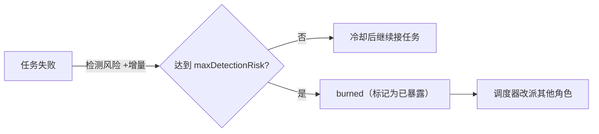

# 操作员与杀伤链

T3MP3ST 把一次授权测试组织成 8 类角色、按 7 个杀伤链阶段推进。这一页讲这个模型在代码里的形态：角色的定义、每个角色的状态机、调度循环、任务模板，以及项目自己声明的实现状态。

代码位置：角色定义在 `src/operators/index.ts`（每类角色一份 `ArchetypeProfile`），调度在 `src/index.ts`（TempestCommand），安全状态在 `src/opsec/`。

## 8 类角色

每类角色由三样东西定义：system prompt、工具类别白名单、MITRE 战术映射。

| 角色 | 杀伤链阶段 | MITRE | 职能 | 项目声明的状态 |
| --- | --- | --- | --- | --- |
| Recon | Reconnaissance | TA0043 | OSINT、DNS 枚举、子域发现、端口扫描 | 完整引擎（live） |
| Scanner | Discovery | TA0007 | 漏洞扫描、服务指纹、配置审计 | 实验性 |
| Exploiter | Initial Access | TA0001 | 利用、载荷投递 | 实验性 |
| Infiltrator | Lateral Movement | TA0008 | 提权、横向移动、凭据访问 | 实验性 |
| Exfiltrator | Collection / Exfiltration | TA0009/10 | 数据收集与外传 | 实验性 |
| Ghost | Persistence | TA0003/05 | 持久化、隐蔽、清理 | 实验性 |
| Coordinator | Command & Control | TA0011 | 任务分发与决策 | 实验性 |
| Analyst | Reporting | — | 分析、报告、风险评级 | 实验性 |

**"实验性"的确切含义**（README 与 WHITEPAPER 反复声明，本章如实转述）：这些角色执行的是同一套真实的 ReAct 循环、调用真实工具（不是空壳），但**多个角色协同编队作战的效果没有经过基准验证**——README 公布的全部数字来自单 Agent 循环。

## 角色状态机：检测风险与禁用

每个角色实例有一份持续累积的状态（`src/operators/index.ts`）：

- 每次任务失败，该角色的检测风险（detectionRisk）增加一个增量，上限为 1；
- 风险达到 `maxDetectionRisk` 时调用 `burn()`（`operators/index.ts:808`），角色状态置为 `burned`（已暴露），**不再复用**——因为检测风险是累积量，失败次数越多继续使用越危险；
- 未禁用时任务之间有冷却时间（默认 5 秒，隐蔽模式 30 秒），降低行为规律性。

与 OPSEC 层联动（`src/opsec/index.ts`）：每次被检测的事件都被记录；超过全局阈值时暂停全部行动。三档 OPSEC 等级（Silent / Covert / Loud）分别对应不同的最大检测容忍、冷却时长与流量特征要求。

## 调度循环：每秒一次

`TempestCommand.tick()` 每秒执行（`src/index.ts:824`），五个动作按固定顺序：

| 步骤 | 行为 | 约束 |
| --- | --- | --- |
| OPSEC 检查 | 触发全局中止条件则暂停全部操作 | 全局阈值优先于单角色 |
| 种任务 | 首轮有目标时按模板生成任务 | 声明式模板（`createReconTasks` 等） |
| 阶段推进 | 当前阶段任务全部完成才进入下一阶段 | 阶段是顺序门，不跳步 |
| 任务派发 | 按角色匹配空闲实例，先检查任务依赖 | `TaskQueue` 支持优先级与依赖 |
| 自动扩编 | 缺少某类角色时自动生成 | 每类上限 3 个 |

任务模板把每个杀伤链阶段展开成具体任务清单（例如侦察阶段对应 DNS、端口、HTTP 指纹）。模板是声明式的：要修改"某个阶段做什么"，改模板即可，调度器不用动。

## 预置编队与交战规则

- 预置编队：`createBalancedTeam()`（八类各一）、`createStealthTeam()`（Recon + Scanner + Ghost，低检测阈值）、`createBreachTeam()`（双 Exploiter 等激进配置）。
- 交战规则（RoE）：`createDefaultRoE()` 与 `createStrictRoE()`（更严的范围与更低的检测容忍）。RoE 在任务入队时就作为硬约束生效，而不是执行时再逐条判断。

## 实现状态速查

| 问题 | 项目自己的回答 |
| --- | --- |
| Recon 是真的吗 | 真实执行 nmap/DNS/HTTP/指纹工具，发现可溯源到工具输出 |
| 多角色协同打过基准吗 | 没有。所有公开数字来自单 Agent 循环 |
| 其余 7 个角色是空壳吗 | 不是空壳——跑同一套真实执行循环；但协同效果未验证 |
| 哪些是纯规划 | `src/stubs/` 下的 SwarmController、CognitionEngine、CloudSecurityEngine 等接口桩 |

## 与其他项目的多角色机制对照

| 话题 | AtkBrain | Claude Code | DSH | T3MP3ST |
| --- | --- | --- | --- | --- |
| 角色来源 | 从者/工人提示词 | `.claude/agents` 定义 | spawn / fork | 8 类角色配置 |
| 角色生命周期 | 每轮全新会话 | 任务级 | 任务级 | 常驻池 + 状态机 |
| 风险状态 | 无显式概念 | 无 | 无 | 检测风险累积 + 禁用 |
| 调度 | 御主方案 + 顺序执行 | 主代理委派 | 收件箱 | 每秒定时调度 + 任务队列 |
| 阶段约束 | 攻击图前沿 | 无 | goal 状态机 | 7 阶段顺序门 |

区别的本质：前几个项目的"多角色"是任务级的（有活才开，用完即弃）；T3MP3ST 的角色是常驻资源，有自己的状态与暴露历史，由固定周期的调度器统一分配。

下一步：[工具层与范围控制](/agents/t3mp3st/arsenal-and-gate)。